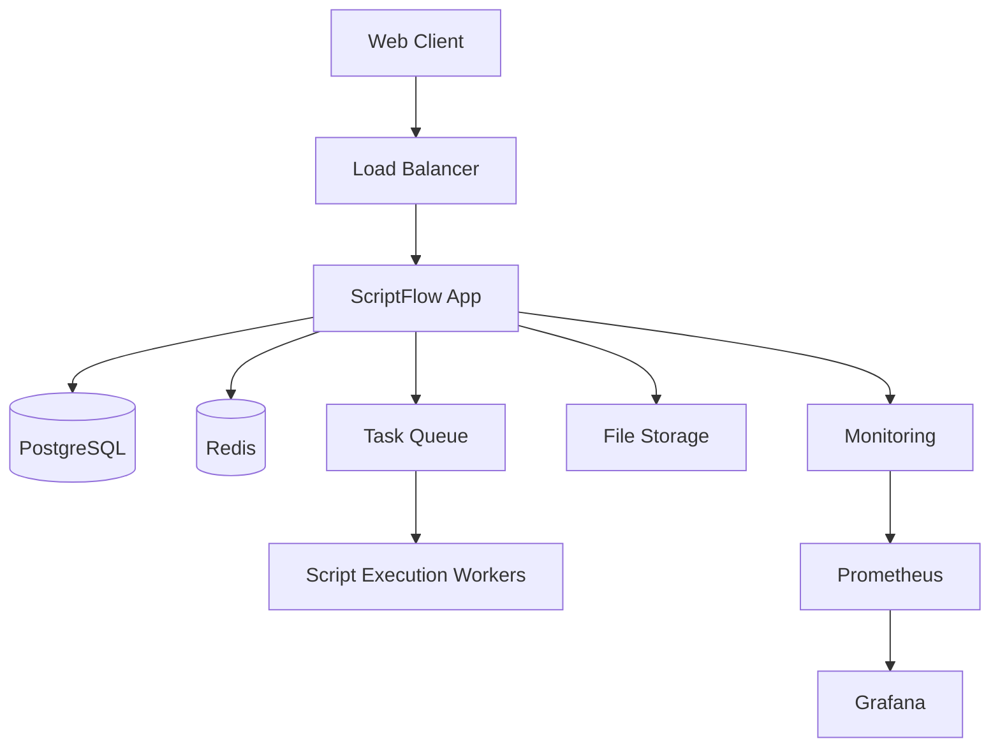

# Welcome to the ScriptFlow Wiki

**ScriptFlow** is an enterprise-grade, open-source script management platform that empowers IT teams and non-technical users to execute, manage, and automate scripts across Windows, macOS, and Linux environments with enterprise-level security and compliance features.

## 🚀 Quick Navigation

### Getting Started
- **[Installation Guide](Installation)** - Complete setup instructions for all environments
- **[Quick Start](Quick-Start)** - Get up and running in 5 minutes
- **[User Guide](User-Guide)** - Comprehensive user documentation
- **[FAQ](FAQ)** - Frequently asked questions

### For Developers
- **[Contributing](Contributing)** - How to contribute to ScriptFlow
- **[API Documentation](API-Documentation)** - Complete API reference
- **[Architecture](Architecture)** - System design and architecture
- **[Development Setup](Development-Setup)** - Local development environment

### For Administrators
- **[Administration Guide](Administration-Guide)** - System administration
- **[Security Guide](Security-Guide)** - Security configuration and best practices
- **[Deployment Guide](Deployment-Guide)** - Production deployment strategies
- **[Monitoring & Logging](Monitoring-and-Logging)** - Observability setup

### Features & Modules
- **[Script Management](Script-Management)** - Creating and managing scripts
- **[Execution Engine](Execution-Engine)** - Script execution capabilities
- **[Scheduling System](Scheduling-System)** - Automated task scheduling
- **[Service Desk](Service-Desk)** - Integrated ticket management
- **[User Management](User-Management)** - Roles and permissions
- **[Sharing & Collaboration](Sharing-and-Collaboration)** - Team collaboration features

### Integration & Automation
- **[CI/CD Integration](CICD-Integration)** - Continuous integration setup
- **[Third-party Integrations](Third-party-Integrations)** - External service connections
- **[Webhooks](Webhooks)** - Event-driven automation
- **[SDK & Libraries](SDK-and-Libraries)** - Client libraries and SDKs

### Support & Community
- **[Troubleshooting](Troubleshooting)** - Common issues and solutions
- **[Release Notes](Release-Notes)** - Version history and changes
- **[Roadmap](Roadmap)** - Future development plans
- **[Community Resources](Community-Resources)** - Forums, chat, and support

## 📊 Platform Overview

### Key Features

#### 🛠️ For IT Teams
- **Multi-Platform Support**: Windows (PowerShell), macOS/Linux (Bash), Ansible, Python
- **Built-in IDE**: Monaco editor with syntax highlighting, IntelliSense, and AI assistance
- **Version Control**: Track script changes with diff comparison and Git integration
- **Secure Execution**: Elevated privileges without credential exposure
- **Advanced Scheduling**: CRON, interval, and event-driven automation

#### 🏢 For Organizations
- **Role-Based Access Control**: 7 distinct user roles with granular permissions
- **Comprehensive Auditing**: Complete activity logs for compliance (NIST, SOX, HIPAA)
- **Service Desk Integration**: Seamless ticket workflow integration
- **Sharing & Collaboration**: Share scripts and results with secure links
- **Commercial Support**: Freemium and enterprise subscription models

#### 🚀 Advanced Capabilities
- **AI-Powered Features**: Script generation, validation, and optimization
- **Real-time Collaboration**: Live editing and execution monitoring
- **Diagnostic Tools**: Built-in system diagnostics for Windows and macOS
- **Enterprise SSO**: LDAP, Active Directory, and SAML integration
- **Performance Monitoring**: Real-time metrics and resource tracking

### User Roles

ScriptFlow supports seven distinct user roles:

1. **Admin** - Full system access and administration
2. **Power User** - Advanced script creation and management
3. **User** - Standard script execution capabilities
4. **Service Desk Agent** - Ticket management and diagnostic scripts
5. **Service Desk Manager** - Service desk administration
6. **Scheduler Admin** - Scheduling system administration
7. **Scheduler User** - Basic scheduling capabilities

### Technology Stack

- **Frontend**: React 18, TypeScript, Tailwind CSS, Monaco Editor
- **Backend**: Node.js, Express, TypeScript, WebSocket
- **Database**: PostgreSQL (production), SQLite (development)
- **Caching**: Redis
- **Authentication**: JWT, RBAC
- **Containerization**: Docker, Kubernetes
- **Monitoring**: Prometheus, Grafana
- **Testing**: Jest, Playwright, Supertest

## 🏗️ Architecture Overview

## 📈 Project Statistics

- **GitHub Stars**: 🌟 Growing open-source community
- **Contributors**: 👥 Welcoming contributors worldwide
- **Languages**: 🌍 Multi-language support
- **Deployments**: 🚀 Production-ready installations
- **Test Coverage**: ✅ 80%+ code coverage
- **Security Rating**: 🔒 NIST compliance ready

## 🤝 Contributing

We welcome contributions from the community! Here's how you can help:

- 🐛 **Report Bugs**: Help us identify and fix issues
- 💡 **Suggest Features**: Propose new functionality
- 🔧 **Submit Code**: Fix bugs or implement features
- 📚 **Improve Documentation**: Help others understand ScriptFlow
- 🧪 **Test Features**: Help with testing new releases

See our [Contributing Guide](Contributing) for detailed information.

## 📞 Getting Help

- **📖 Documentation**: Start with our comprehensive guides
- **💬 Discord**: Join our community chat
- **🐙 GitHub Issues**: Report bugs and request features
- **📧 Email Support**: Professional support available
- **🎓 Training**: Online courses and certification

## 📄 License

ScriptFlow is released under the [MIT License](https://github.com/Steve-M365/scriptflow/blob/main/LICENSE).

## 🔗 Quick Links

- **🏠 Homepage**: [scriptflow.dev](https://scriptflow.dev)
- **📁 GitHub Repository**: [github.com/Steve-M365/scriptflow](https://github.com/Steve-M365/scriptflow)
- **📖 Documentation**: [docs.scriptflow.dev](https://docs.scriptflow.dev)
- **💬 Community**: [community.scriptflow.dev](https://community.scriptflow.dev)
- **🐦 Twitter**: [@ScriptFlow](https://twitter.com/scriptflow)

---

**Last Updated**: December 2024 | **Version**: 1.0.0